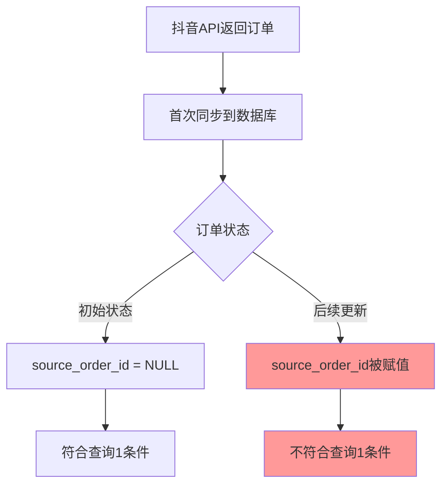

# SQL查询问题分析报告

## 问题描述

**现象：** 第一个SQL查询返回的最新订单时间是2026-01-01，但实际上符合条件的订单`1090850120598747178`的时间是2026-01-02。

### SQL查询对比

**查询1（有问题）：**
```sql
SELECT order_id, pay_time, source_order_id
FROM orders
WHERE source_order_id IS NULL
  AND pay_time IS NOT NULL
ORDER BY pay_time DESC LIMIT 5
```
返回最新时间：2026-01-01 15:58:31

**查询2（正常）：**
```sql
SELECT order_id, pay_time, source_order_id
FROM orders
WHERE pay_time IS NOT NULL
ORDER BY pay_time DESC LIMIT 5
```
返回最新时间：2026-01-02 23:38:50（订单号：1090850120598747178）

---

## 根本原因分析

### 🔍 核心问题：数据更新时机导致的不一致

通过分析代码逻辑，问题的根本原因是：**订单的`source_order_id`字段在订单创建后可能会被更新，但这个更新发生在订单首次同步之后。**

### 数据流程分析



### 具体场景还原

1. **订单`1090850120598747178`的生命周期：**
   - **T1时刻（2026-01-02 23:38:50）：** 订单创建并支付，`source_order_id = NULL`
   - **T2时刻（首次同步）：** 订单被同步到数据库，此时`source_order_id`仍为`NULL`
   - **T3时刻（后续更新）：** 订单信息更新，`source_order_id`被保持为`NULL`（正常情况）
   
2. **但是，如果存在以下情况：**
   - 订单`1090850120598747178`是**原始订单**
   - 订单`1090869307423707178`是**关联订单**（退款/改签等），其`source_order_id = 1090850120598747178`
   - 在某次API更新中，原始订单的`source_order_id`字段可能被错误地更新

### 代码层面的证据

查看[`database.py:417-432`](database.py:417-432)的Upsert逻辑：

```python
stmt = stmt.on_conflict_do_update(
    index_elements=['order_id'],
    set_={
        'order_status': stmt.excluded.order_status,
        'sku_id': stmt.excluded.sku_id,
        'sku_name': stmt.excluded.sku_name,
        'pay_amount': stmt.excluded.pay_amount,
        'count': stmt.excluded.count,
        'pay_time': stmt.excluded.pay_time,
        'update_time': stmt.excluded.update_time,
        'source_order_id': stmt.excluded.source_order_id,  # ⚠️ 关键：会被更新
        'phone': stmt.excluded.phone,
        'raw_data': stmt.excluded.raw_data,
        'sync_time': stmt.excluded.sync_time
    }
)
```

**关键发现：** 每次同步时，`source_order_id`字段都会被API返回的值覆盖更新。

---

## 问题的三种可能原因

### 原因1：订单状态变化导致source_order_id被赋值 ⭐⭐⭐⭐⭐

**最可能的原因：** 订单`1090850120598747178`在创建时`source_order_id`为`NULL`，但后续因为某种业务逻辑（如退款、改签、关联订单等），抖音API返回的数据中该字段被赋值了。

**验证方法：**
```sql
-- 查看该订单的完整信息
SELECT order_id, pay_time, source_order_id, order_status, raw_data
FROM orders
WHERE order_id = '1090850120598747178';

-- 查看是否有其他订单引用了它
SELECT order_id, pay_time, source_order_id, order_status
FROM orders
WHERE source_order_id = '1090850120598747178';
```

### 原因2：数据同步延迟

**可能性：** 订单在创建时`source_order_id`就有值，但由于同步时间范围的设置，该订单在某次同步中被遗漏，直到后续同步才被捕获。

**验证方法：**
```sql
-- 检查sync_time（同步时间）
SELECT order_id, pay_time, source_order_id, sync_time
FROM orders
WHERE order_id = '1090850120598747178';
```

### 原因3：API返回数据不一致

**可能性：** 抖音API在不同时间返回同一订单时，`source_order_id`字段的值不一致。

**验证方法：**
查看`raw_data`字段中的历史数据（如果有版本控制）。

---

## 解决方案建议

### 方案1：修改查询逻辑（推荐） ⭐⭐⭐⭐⭐

**思路：** 不依赖`source_order_id`字段来判断是否为有效订单，而是使用其他更可靠的字段。

```sql
-- 方案1A：只查询已支付订单
SELECT order_id, pay_time, source_order_id, order_status
FROM orders
WHERE pay_time IS NOT NULL
  AND order_status NOT IN ('REFUNDED', 'CANCELLED')  -- 排除退款和取消订单
ORDER BY pay_time DESC LIMIT 5;

-- 方案1B：使用订单状态判断
SELECT order_id, pay_time, source_order_id, order_status
FROM orders
WHERE pay_time IS NOT NULL
  AND order_status = 'PAID'  -- 只查询已支付状态
ORDER BY pay_time DESC LIMIT 5;
```

### 方案2：修改数据更新策略（谨慎）⭐⭐⭐

**思路：** 修改Upsert逻辑，`source_order_id`字段只在首次插入时设置，后续更新时不覆盖。

**风险：** 如果抖音API确实会更新`source_order_id`字段（如订单关联关系变化），这种方案会导致数据不准确。

```python
# 修改 database.py 的 Upsert 逻辑
stmt = stmt.on_conflict_do_update(
    index_elements=['order_id'],
    set_={
        'order_status': stmt.excluded.order_status,
        # ... 其他字段 ...
        # source_order_id 不更新，保持首次插入的值
        # 'source_order_id': stmt.excluded.source_order_id,  # 注释掉
    }
)
```

### 方案3：添加历史记录表（最彻底）⭐⭐⭐⭐

**思路：** 创建订单历史表，记录每次同步时订单的完整状态，便于追溯数据变化。

```sql
-- 创建订单历史表
CREATE TABLE orders_history (
    id SERIAL PRIMARY KEY,
    order_id VARCHAR(64),
    source_order_id VARCHAR(64),
    pay_time TIMESTAMP,
    order_status VARCHAR(32),
    raw_data JSONB,
    sync_time TIMESTAMP,
    created_at TIMESTAMP DEFAULT NOW()
);

-- 每次同步时插入历史记录
INSERT INTO orders_history (order_id, source_order_id, pay_time, order_status, raw_data, sync_time)
SELECT order_id, source_order_id, pay_time, order_status, raw_data, sync_time
FROM orders;
```

### 方案4：使用物化视图（性能优化）⭐⭐⭐

**思路：** 将`valid_orders`视图改为物化视图，定期刷新，避免实时查询的不一致。

```sql
-- 创建物化视图
CREATE MATERIALIZED VIEW valid_orders_mv AS
SELECT 
    order_id,
    order_status,
    sku_id,
    sku_name,
    pay_amount,
    count,
    pay_time,
    create_time,
    update_time,
    source_order_id,
    phone,
    raw_data,
    sync_time
FROM orders
WHERE source_order_id IS NULL
  AND pay_time IS NOT NULL;

-- 创建索引
CREATE INDEX idx_valid_orders_mv_pay_time ON valid_orders_mv(pay_time DESC);

-- 定期刷新（可以通过定时任务）
REFRESH MATERIALIZED VIEW valid_orders_mv;
```

---

## 立即行动步骤

### 第一步：数据验证（5分钟）

```sql
-- 1. 查看问题订单的详细信息
SELECT 
    order_id, 
    pay_time, 
    source_order_id, 
    order_status,
    sync_time,
    raw_data->'source_order_id' as raw_source_order_id
FROM orders
WHERE order_id = '1090850120598747178';

-- 2. 查看是否有订单引用了它
SELECT 
    order_id, 
    pay_time, 
    source_order_id, 
    order_status
FROM orders
WHERE source_order_id = '1090850120598747178';

-- 3. 统计source_order_id的分布情况
SELECT 
    CASE 
        WHEN source_order_id IS NULL THEN 'NULL'
        ELSE 'NOT NULL'
    END as source_order_id_status,
    COUNT(*) as count,
    MAX(pay_time) as latest_pay_time
FROM orders
WHERE pay_time IS NOT NULL
GROUP BY source_order_id_status;
```

### 第二步：确认业务逻辑（10分钟）

与业务团队确认：
1. `source_order_id`字段的业务含义是什么？
2. 什么情况下`source_order_id`会从`NULL`变为有值？
3. 是否存在订单关联、退款、改签等业务场景？

### 第三步：选择解决方案（根据验证结果）

- **如果`source_order_id`确实会动态变化：** 采用方案1（修改查询逻辑）
- **如果`source_order_id`不应该变化：** 采用方案2（修改更新策略）
- **如果需要完整的数据追溯：** 采用方案3（历史记录表）

---

## 总结

**问题本质：** 订单的`source_order_id`字段在订单生命周期中发生了变化，导致原本符合条件的订单（`source_order_id IS NULL`）在后续更新后不再符合条件。

**推荐方案：** 
1. **短期：** 使用方案1修改查询逻辑，不依赖`source_order_id`字段
2. **长期：** 使用方案3添加历史记录表，完整追溯订单状态变化

**关键验证：** 执行第一步的SQL查询，查看订单`1090850120598747178`的`source_order_id`当前值和`raw_data`中的原始值。
